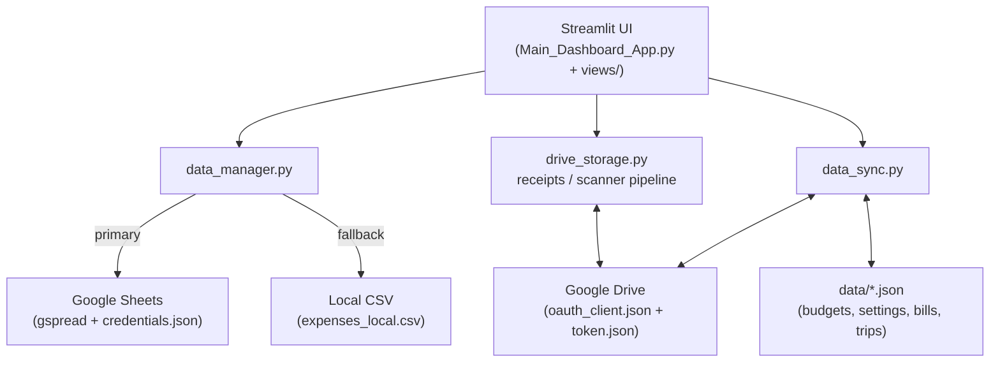

# 💳 Expense Tracker Dashboard

A powerful, multi-page personal finance dashboard built with **Streamlit**. Track every
purchase down to the individual item, get AI-powered spending insights, scan receipts,
manage budgets, track trips, calculate your net worth, and generate tax reports — all
from one clean, themeable web app.

Data is stored in **Google Sheets** (with an automatic local-CSV fallback) and can be
synced across machines through **Google Drive**. Every feature is optional and toggles
on automatically when its dependencies are available.


---

## 📑 Table of Contents

1. [Key Features](#-key-features)
2. [Requirements](#-requirements)
3. [Installation](#-installation)
4. [Configuration & Credentials](#-configuration--credentials)
5. [Running the Dashboard](#-running-the-dashboard)
6. [The Homepage & Sidebar](#-the-homepage--sidebar)
7. [Pages & Features (with screenshots)](#-pages--features)
8. [Themes](#-themes)
9. [The Expense Data Model](#-the-expense-data-model)
10. [Storage & Sync Architecture](#-storage--sync-architecture)
11. [Project Structure](#-project-structure)
12. [Testing](#-testing)
13. [Troubleshooting](#-troubleshooting)

---

## ✨ Key Features

| Area | What you get |
|------|--------------|
| 🏠 **Item-level tracking** | Log purchases per item, with brand, quantity, unit, shop, category & subcategory |
| 🧠 **Spending Intelligence** | Hotspots, temporal patterns, savings opportunities, smart KPIs |
| 📊 **Analytics** | Trends, forecasts, year-over-year / month-over-month, heatmaps |
| 🎯 **Budgets & Alerts** | Monthly / category budgets with 80/90/100% threshold, predictive & velocity alerts |
| 🔁 **Recurring & Income** | Auto-posting recurring templates + a full income ledger |
| 🏦 **Net Worth** | Track assets & liabilities over time |
| 💰 **Price Tracker** | See how item prices change and where to find the best deals |
| 📷 **Receipt Scanner (OCR)** | AI vision extraction (Claude → GPT‑4o → Gemini → Tesseract) |
| 🧾 **Tax Reports** | Deductible vs non-deductible breakdowns, Excel export |
| 🤖 **AI Insights** | Chat with your own spending data + automatic narrative reports |
| ✈️ **Trips** | Per-trip expense tracking with multi-currency support |
| 👥 **Team & Splits** | Multiple users with password auth and expense splitting |
| 🌍 **Multi-currency** | 15 currencies with live conversion to your base currency |
| 🎨 **8 Themes** | Light, Dark, Ocean, Forest, Sunset, Midnight, Rose, Slate |
| ☁️ **Cloud sync** | Google Sheets storage + Drive sync, with offline local fallback |

---

## 🛠 Requirements

- **Python 3.11** (recommended; the bundled virtual environment uses 3.11)
- **pip** / **venv**
- (Optional) A **Google Cloud** project with the *Sheets API* and *Drive API* enabled
- (Optional) **Tesseract OCR** binary for offline receipt scanning
  - macOS: `brew install tesseract`
  - Ubuntu/Debian: `sudo apt install tesseract-ocr`
- (Optional) API keys for **Gemini**, **Anthropic (Claude)**, and/or **OpenAI** for
  AI Insights and AI-based receipt scanning

### Python packages

All dependencies are listed in [requirements.txt](requirements.txt):

| Group | Packages |
|-------|----------|
| Core | `streamlit`, `plotly`, `pandas`, `numpy`, `openpyxl` |
| Modern UI (optional) | `streamlit-extras`, `streamlit-lottie` |
| Google Sheets | `gspread`, `oauth2client` |
| Google Drive | `google-api-python-client`, `google-auth`, `google-auth-oauthlib` |
| Currency | `requests` |
| Config | `python-dotenv` |
| Validation | `pydantic>=2.0` |
| Forecasting | `statsmodels` |
| ML (optional) | `scikit-learn` |
| Receipt OCR (optional) | `Pillow`, `pytesseract` |
| Testing | `pytest`, `pytest-cov` |

> 💡 If you use the **Price Tracker's** gradient-styled tables, also install
> `matplotlib` (`pip install matplotlib`) — pandas uses it for background gradients.

---

## 📦 Installation

```bash
# 1. Clone the repository
git clone <your-repo-url>
cd Expense-Tracker-Dashboard

# 2. Create and activate a virtual environment
python3.11 -m venv .venv
source .venv/bin/activate          # Windows: .venv\Scripts\activate

# 3. Install dependencies
pip install --upgrade pip
pip install -r requirements.txt

# 4. (Optional) Install extras used by some pages
pip install matplotlib             # Price Tracker gradient tables
```

The app runs immediately using the local **`expenses_local.csv`** file — no Google
setup required to try it out.

---

## 🔐 Configuration & Credentials

All optional integrations are configured through three mechanisms. **None of these
files should be committed to version control.**

### 1. Google Sheets & Drive (optional cloud storage)

Storage settings live in [config.py](config.py):

```python
USE_GOOGLE_SHEETS = True           # set False to force local-CSV mode
SHEET_NAME       = "ExpenseTracker"
WORKSHEET_NAME   = "Transactions"
LOCAL_CSV_FILE   = "expenses_local.csv"
```

| File | Purpose | How to obtain |
|------|---------|---------------|
| `credentials.json` | **Service-account** key used by `gspread` to read/write the spreadsheet | Google Cloud Console → *APIs & Services → Credentials → Create service account key*. Then **share your Google Sheet** with the service account's email. |
| `oauth_client.json` | **OAuth 2.0 "Desktop app"** client used for Drive uploads (receipts & data-file sync). A service account has no personal Drive quota, so a real user login is required. | Google Cloud Console → *Credentials → Create OAuth client ID → Desktop app* → download JSON. |
| `token.json` | Saved/refreshable **user token** for Drive access | Auto-generated the first time you run `authorize_drive.py`. |

**One-time Drive authorization:**

```bash
python authorize_drive.py
# A browser window opens → log in → token.json is written
```

If Drive/Sheets are unavailable, the app transparently falls back to the local CSV and
the `receipts/` folder, so it always keeps working offline.

### 2. AI keys — `.streamlit/secrets.toml` (optional)

AI Insights and AI receipt scanning read keys from `st.secrets`. Create
`.streamlit/secrets.toml`:

```toml
GEMINI_API_KEY    = "..."   # https://aistudio.google.com/app/apikey (free tier)
ANTHROPIC_API_KEY = "..."   # https://console.anthropic.com
OPENAI_API_KEY    = "..."   # https://platform.openai.com
```

The provider cascade is **Gemini → Claude → GPT‑4o** (whichever key is present).
For receipt OCR the order is **Claude → GPT‑4o → Gemini → Tesseract fallback**.

### 3. Email notifications — environment variables / `.env` (optional)

Email alerts are sent via SMTP (Gmail by default). Add these to a `.env` file or your
shell environment (loaded via `python-dotenv`):

```dotenv
SMTP_SERVER=smtp.gmail.com
SMTP_PORT=587
SENDER_EMAIL=you@gmail.com
SENDER_PASSWORD=your_app_password   # Gmail "App Password", not your login password
RECEIVER_EMAIL=you@gmail.com
```

> 🔒 **Security:** Keep `credentials.json`, `oauth_client.json`, `token.json`,
> `.streamlit/secrets.toml`, and `.env` out of git (add them to `.gitignore`). Never
> paste secrets into shared chats or commits.

---

## ▶️ Running the Dashboard

```bash
# with the virtual environment activated
streamlit run Main_Dashboard_App.py
```

Then open the URL Streamlit prints (default <http://localhost:8501>).

**Startup sequence** ([Main_Dashboard_App.py](Main_Dashboard_App.py)):

1. Apply page config (wide layout, expanded sidebar) and the active theme
2. Initialize storage (Google Sheets, or local CSV fallback)
3. Pull the latest `data/*.json` state from Drive (best-effort)
4. Load expenses, run a one-time de-duplication write-back
5. Auto-post any due recurring templates (once per session)
6. Apply multi-user filtering (if enabled)
7. Build the sidebar and route to the selected page

---

## 🧭 The Homepage & Sidebar

When the app loads it lands on the **🏠 Dashboard**. The **left sidebar** is your control
center and contains:

- **🎨 Theme picker** — switch between 8 palettes instantly
- **Navigation** — one button per page (order is defined once in the page registry)
- **➕ Add Expense** — a multi-item entry form that renders directly into the sidebar
- **Filters & Export** — narrow the dataset and download CSV/Excel
- **🔓 Sign In** — user switcher (when Team & Splits is enabled)
- **💭 What-if Simulation** — "what if I cut category X by Y%?" live projection

The main dashboard canvas shows:

- A **pending-bills badge** and an **active-alerts banner** (only when relevant)
- **⚡ Quick Intelligence** — this month's spend, month projection, and top category
- Three tabs: **📊 Overview** (KPIs + monthly bar + category donut),
  **🧾 Records** (transactions grouped by date & shop), and **🧠 Insights**

### The Add-Expense form

The sidebar **Add Expense (multi-item mode)** form captures, per item:

`Date` · `Expense Type` · `Shop` · `Currency` (live FX rate shown) · `Category` ·
`Subcategory` · `Item` * · `Brand` · `Quantity` * · `Unit` · `Amount` *

Fields marked `*` are required. Dropdowns support **add-new** inline, duplicate
detection warns before saving, and amounts are converted to your base currency (SEK).

---

## 📄 Pages & Features

The dashboard ships **22 pages**. Optional pages appear automatically when their module
and dependencies are present (controlled by `HAS_*` flags in
[feature_flags.py](feature_flags.py)).

### 🏠 Dashboard
Overview KPIs, quick-intelligence strip, alerts, and transactions grouped by date/shop.


### 🧠 Intelligence
Deep behavioral analysis across tabs: **Hotspots** (where you spend most),
**Budget Intelligence** (smart recommendations), **Savings** (opportunities to cut),
and **Patterns** (temporal spending trends).


### 📊 Analytics
Historical spending with date-range presets (30 days, 3/6/12 months, YTD, All Time),
granularity selectors (daily/weekly/monthly/yearly), category filters, pie charts,
monthly trends, multi-year comparisons, calendar heatmaps, and forecasting.


### ✏️ Edit & Delete
Filter by year/month and expense details, then edit or delete individual records in an
inline, spreadsheet-like table. Unsaved-changes are detected and saved on demand.


### 📤 Import / Export
Two tabs — **Import** (upload CSV/Excel and merge into your data) and **Export**
(download the current dataset as CSV or Excel).


### 🧾 Pending Bills
Capture a bill by **total amount now, itemise later**. Attach a receipt copy (image/PDF),
then break it into line items whenever you're ready. Pending bills never touch analytics
until they're itemised.


### 📒 Bills Ledger
A consolidated **shop · date · amount** view that merges itemised expenses, pending
bills, and manually-added entries — with stats, filtering, sorting and CSV export.


### ✈️ Trips
Track spending per trip. Each trip is a card with status (Planned/Active/Completed),
date range, duration, and total in the trip's currency. Open a trip for a day-by-day
ledger and category breakdown.


### ⚙️ Settings
Configure **Alerts** (enable budget alerts; 80% / 90% / exceeded thresholds; predictive
& velocity alerts), **Email** notification setup, and view **Help**.


### 🎯 Budgets
Set a total monthly budget and optional per-category budgets, then track progress with
daily-average, projected-spend and days-remaining metrics.


### 💰 Price Tracker
Analyze how item prices change over time: items tracked, average price increase, items
getting more expensive, and price volatility — with tabs for Price Increases, Item
Lookup, Best Deals and Full Analysis.


### 📈 Financial Metrics
Savings rate, expense volatility, cash flow, and trend analysis. Most accurate when you
also log income (see the Income page).


### 📷 Receipt Scanner
A crash-resumable **3-stage pipeline**: **Upload → Translate & Push → Archive**. Upload a
receipt (JPG/PNG/WebP/PDF), let AI vision read, translate and categorise it, then push
line items into your expense table. Files are mirrored locally and to Google Drive at
every stage.


### 🧾 Tax Reports
Pick a tax year and your deductible categories to get totals for total / deductible /
non-deductible spend, a category breakdown, monthly spending chart, and an Excel export.


### 🤖 AI Insights
Chat with your own spending data — the model reads a compact summary of your DataFrame
(not the internet) and answers questions, plus generates monthly narrative reports.


### Other optional pages

| Page | Description |
|------|-------------|
| 🔁 **Recurring** | Define recurring expense templates (daily → yearly) that auto-post when due |
| 💵 **Income** | A first-class income ledger for accurate savings-rate and cash-flow math |
| 🏦 **Net Worth** | Track assets (checking, savings, cash, investments, property) and liabilities |
| 🤖 **Smart Categorize** | Rule-based + optional ML auto-categorization of expenses |
| 👥 **Team & Splits** | Multiple users (PBKDF2 password hashing) and expense splitting |
| 🔔 **Notifications** | Email alert settings for budgets, summaries and predictive warnings |
| 💾 **Backups** | Automatic timestamped CSV/Excel backups with rotation and restore |

---

## 🎨 Themes

Eight palettes are available from the sidebar theme picker (defined in
[theme.py](theme.py)):

☀️ **Light** · 🌑 **Dark** · 🌊 **Ocean** · 🌿 **Forest** · 🌅 **Sunset** ·
🌙 **Midnight** · 🌸 **Rose** · ⬜ **Slate**

The theme is applied globally and passed explicitly to every chart, so colors stay
consistent across the whole app.


---

## 🗃 The Expense Data Model

Each expense row uses the columns defined in the `Columns` class in
[config.py](config.py):

| Column | Meaning |
|--------|---------|
| `Date` | Transaction date (YYYY‑MM‑DD) |
| `ExpenseType` | e.g. *Goods* or *Service* |
| `Category` / `Subcategory` | Primary and optional secondary classification |
| `Item` | Product / service name (required) |
| `Brand` | Brand or vendor (optional) |
| `Shop` | Merchant / store |
| `PricePaid` | Amount paid, in base currency (required) |
| `Currency` | Original currency code (default `SEK`) |
| `Quantity` / `QuantityUnit` | Amount and unit (Count, Kg, Litre, …) |
| `PricePerUnit` | Computed per-unit price |
| `EntryId` | Stable short UUID for identity-based de-duplication |

Computed helper columns (`Year`, `Month`, `MonthName`, `YearMonth`, `dow`, `week`) are
added on the fly during analysis.

**Currencies supported:** SEK, INR, USD, EUR, GBP, JPY, CHF, AUD, CAD, CNY, THB, SGD,
AED, NOK, DKK (base currency defaults to **SEK**).

---

## ☁️ Storage & Sync Architecture



- **`data_manager.py`** — loads/saves expenses to Google Sheets, with automatic
  de-duplication and a local-CSV fallback.
- **`data_sync.py`** — pulls/pushes the small JSON state files (budgets, dropdown
  options, settings, pending bills, trips) to the same Drive folder as the spreadsheet,
  so app state follows your data across machines.
- **`drive_storage.py`** — uploads receipt copies to an *Expense Receipts* subfolder on
  Drive, storing only references (not bytes); falls back to the local `receipts/` folder.

---

## 🗂 Project Structure

```
Expense-Tracker-Dashboard/
├── Main_Dashboard_App.py     # Entry point: config, data load, sidebar, router
├── feature_flags.py          # HAS_* flags + import stubs for optional modules
├── config.py                 # Constants: columns, currencies, file paths, cache TTLs
├── theme.py                  # 8 theme palettes + apply_theme()
├── requirements.txt
├── authorize_drive.py        # One-time Google Drive OAuth flow → token.json
│
├── views/                    # One module per page
│   ├── page_dashboard.py
│   ├── page_intelligence.py
│   ├── page_analytics.py
│   ├── page_edit.py
│   ├── page_import_export.py
│   ├── page_trips.py
│   ├── page_pending_bills.py
│   └── page_bills_ledger.py
│
├── data_manager.py           # Google Sheets / CSV storage
├── data_sync.py              # Drive JSON state sync
├── drive_storage.py          # Drive receipt storage
├── budget_manager.py         # Budgets
├── recurring_manager.py      # Recurring templates
├── income_manager.py         # Income ledger
├── accounts_manager.py       # Net worth
├── price_tracker.py          # Price analysis
├── financial_metrics.py      # Savings rate, cash flow, volatility
├── receipt_ocr.py            # AI receipt extraction
├── tax_export.py             # Tax reports
├── ml_categorizer.py         # Smart categorization
├── multi_user_manager.py     # Users & splits
├── notification_manager.py   # Email alerts
├── backup_manager.py         # Backups
├── ai_insights.py            # AI chat + narratives
├── spending_intelligence.py  # Hotspots, patterns, savings
├── currency_manager.py       # FX conversion
├── ui_components.py           # Add-expense form, filters
├── analytics*.py, charts.py   # Charts & analytics helpers
│
├── data/                     # JSON state (budgets, settings, trips, …)
├── receipts/                 # Local receipt mirror
├── scanner/                  # Receipt-pipeline stages (1_uploads → 3_final)
└── docs/screenshots/         # Screenshots used in this README
```

---

## 🧪 Testing

```bash
# run the test suite
pytest

# with coverage
pytest --cov
```

Tests live in [test_expense_tracker.py](test_expense_tracker.py).

---

## 🩺 Troubleshooting

| Symptom | Fix |
|---------|-----|
| App loads but data is empty | Check `credentials.json` and that the Sheet is **shared** with the service account; otherwise it falls back to `expenses_local.csv`. |
| Receipt uploads fail | Run `python authorize_drive.py` to (re)generate `token.json`; a service account can't own personal Drive files. |
| `ImportError: matplotlib` on Price Tracker | `pip install matplotlib`. |
| AI Insights / Scanner say "no key" | Add `GEMINI_API_KEY` / `ANTHROPIC_API_KEY` / `OPENAI_API_KEY` to `.streamlit/secrets.toml`. |
| No email alerts | Set `SENDER_EMAIL`, `SENDER_PASSWORD` (Gmail App Password) and `RECEIVER_EMAIL` in `.env`. |
| Tesseract OCR fallback errors | Install the Tesseract binary (`brew install tesseract` / `apt install tesseract-ocr`). |
| A page is missing from the sidebar | Its optional module or dependency isn't installed — check the matching `HAS_*` flag in `feature_flags.py`. |

---

*Screenshots in this README were captured from the live app and stored in
[docs/screenshots](docs/screenshots).*
